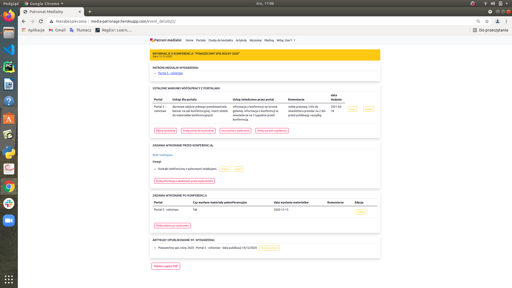
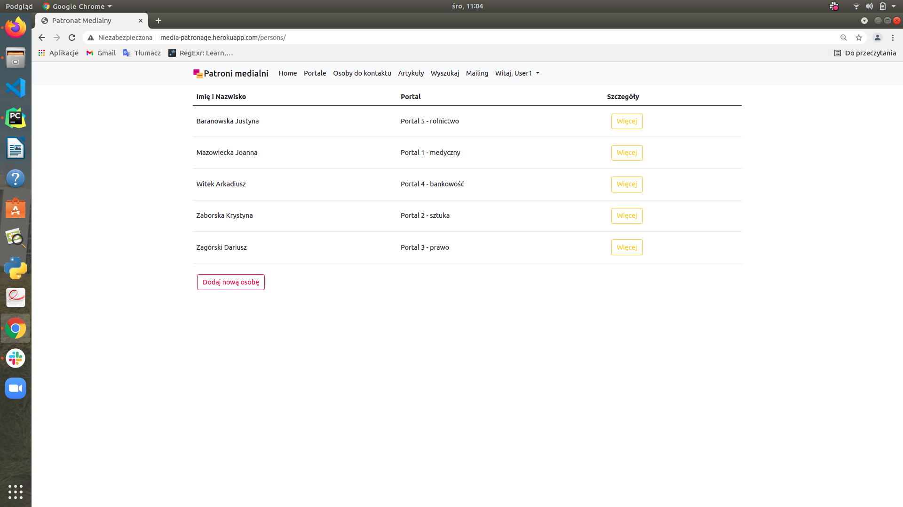

## Managing media patronage app.

Simple app for facilitate media patronage cooperation. It organizes contacts in transparent manner.

### Table of contents
* [General info](#general-info)
* [How the application is built](#how-the-application-is-built)
* [Technologies](#technologies)
* [Live version](#live-version)
* [Screen Shots](#screen-shots)

### General info:

This is application for managing PR activities during process of organizing conferences and afterwards.
It is used to:
* manage contacts of various thematic portals (media patronages),
* storing information about portals, contact persons and about published articles.
* it also enable to send mass emails to contact persons from database. The form is constructed that you choose the thematic categories of portal which corresponds with the event's theme.

It aims to facilitate the work on the overall process of acquiring media patrons and their service,
by eliminating "keeping" contact details, information about the terms of cooperation in various xls tables
and scattered directories on the server.

Keeping all information in one place will also allow you to quickly prepare a report on PR activities
without digging through hundreds of emails and creating separate txt documents.

### How the application is built:
The application consists of six pages:

#### "Home" 
It is the main page of the application, where you see the list of all conferences. They are ordered by date.
Logged user can add, delete conferences and can add patrons for the conference. By clicking on event's title he can see the events details: media patrons, terms of cooperation with them, what was done before and after event and informations about send emails, he can also: add, delete, update all of this and download pdf report.

#### "Portale" 
Here you have list of all portals (media patrons) from database. When clicking on "więcej" button you will see the details of this portal (address, email, phone number, logotype). Logged user can add new portal to the database and on the details page update and delete.

#### "Osoby do kontaktu"
Here is list of all contact persons ordered alphabetically by surname. Logged user can add new person and on details page he can delete and update person.

#### "Artykuły" 
Here is list of all articles that were published by cooperating portals, they concerns organized conferences (titles, portal, date of publication, "pobierz artykuł" button enables downloading the article).

#### "Wyszukaj" 
On this page you can search for person, portal or event.

#### "Mailing" 
Only logged user can use this page. It contains mailing form wich enables sending mass emails to contact persons from database. You chose the event, the portals category, provide email title and message.

### Technologies:
* Python 3.6.9
* Django framework 3.1.
* Cloudinary (for media storage) 
* Postgresql
* python-decouple (for configuration)
* Bootstrap4

### Live version: 
On Heroku: http://media-patronage.herokuapp.com/

To see all functionalities you can **log as:** User1, **password:** testtesttest

### Screen Shots:
**Home page for logged user:** 
 
**Event details:** 

**Contacts list:** 
 
**Contact details:**
 

